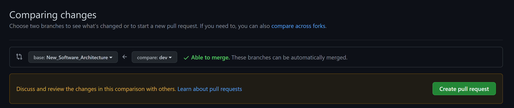

# Git Workflow

1. Create Issue

    

2. Create new branch from main named like issue

    You can create a new branch directly on Git, or you can create a new branch the following:

    ```bash
    git branch issue
    git checkout issue
    ```

3. Commit your changes and push to issue branch
4. Checkout to main branch

    ```bash
    git checkout main
    ```

5. Pull newest main branch

    ```bash
    git pull
    ```

6. Checkout to issue branch

    ```bash
    git checkout issue
    ```

7. Add new changes from main branch to feature branch

    ```bash
    git merge main
    ```

    

8. Commit and push all changes to origin

    ```bash
    git commit -m "Merged changes on main to issue branch"
    git push
    ```

9. Create pull request to merge issue branch to dev branch.
Choose the branch you want to merge on the left (here New_Software_Architecture) and the dev branch on the right.
    