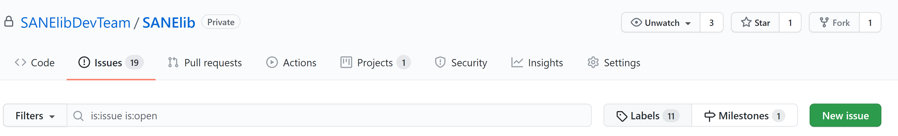
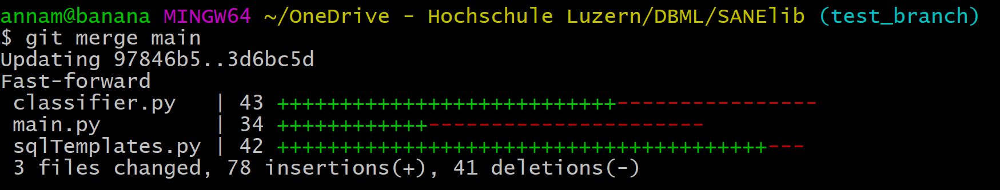
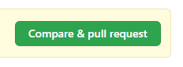

# SANElib Prototype

The goal of this prototype is to implement ML procedures using SQL code generation. The idea is, that there are some efficiency advantages in calculating the results of ML algorithms directly in SQL. 

## Contribute

If you're interested to contribute to this project note the following information:

- Project Structure:

  |- sanelib.py (SANElib factory)

  |- config.py (Database configuration parameters)

  |- requirements.txt (Python requirements)

  |- lib (Main library)

  -----|- linear_regression

  -----|- mdh

  -----|- ...

  |- util (General utilities)

  -----|- database (Database connection utilities)

  |- example_datasets (Example datasets for implementations)

  |- images (Documentation images)			

- util/database.py DBConnection

  - **execute**(query)

    Executes query inside the database.

    `Parameters`

    *query: SQL query (String/Text)*.

  - **execute_query**(query)

    Executes query inside the database and returns it's results.

    `Parameters`

    *query: SQL query (String/Text)*.

    `Return`: *Returns the result of the query provided*. 	 									

- Quick Start (please also refer to existing implementations):

1. Create Issue

2. 

3. Create new branch from dev named like issue.

4. You can create a new branch directly on Git, or you can create a new branch the following:

5. ```bash
   git checkout dev
   git pull
   git branch issue
   git checkout issue
   ```

6. Commit your changes and push to issue branch

7. Checkout to dev branch

8. ```bash
   git checkout dev
   ```

9. Pull newest dev branch

10. ```bash
    git pull
    ```

11. Checkout to issue branch

12. ```bash
    git checkout issue
    ```

13. Add new changes from dev branch to feature branch

14. ```bash
    git merge dev
    ```

15. 

16. Commit and push all changes to origin

17. ```bash
    git commit -m "Merged changes on dev to issue branch"
    git push
    ```

18. Create pull request to merge issue branch to dev branch.

19. Choose the branch you want to merge on the right (here kmeans) and the dev branch on the left.
      

20. Create a new folder under lib with the name of your implementation.

21. Create a new folder "sql_templates" in your implementation folder.

22. Create your main python file (e.g. "implementation_x").

23. Add your implemenation_x.py to init.py inside the lib folder.

24. Extend sanelib.py with your implementation (x = lib.x.x(db))

- #### Database functions (util)

  - **get_column**(database, table)

    `Parameters`

    *database: Database in which the table to be queried lies.* 

    *table: Table to query the column names from.*

    `Return`: *Returns all column names of a table in a numpy array.*

  - **get_number_of_rows**(database, table)

    `Parameters`

    *database: Database in which the table to be queried lies.*

    *table: Table to query the number of rows from.*

    `Return`: *Returns the number of rows listed in a table.*

## Available implementations

### Multidimensional histogram (MDH) probability estimation

- **Input**: A data table, which is larger than the working memory, can be input as parameter. This table is processed based on a file or a database. 
- **Training phase**: The input data table is quantized (equal size, N_TILE vs. equal width, WIDTH_BUCKET) and indexed in a SQL-DBMS using SQL. This quantized index then represents an in-database model for density estimation.
- **Prediction phase**: Based on this model For a new record or set of records, it is possible to determine a multivariate density estimation for a new data record or a whole set of records for selected columns of the table.
- **Visualization**: The density function can be visualized with R or Python relatively easily in 1D and 2D.
- **Embedded DBMS**: By default, an embedded DBMS is used for the calculation (e.g. H2 or SQLite) and the calculation is done locally on the client.
- **Code-to-Data**: Any connection to a database server can be configured via a parameter, so that a server-side calculation in SQL can be performed.

#### Test Database

In order to test the SANElib library run the main.py file. We created a sql script, which creates a revised version of the Covertype dataset, where the categorical attributes have been unpivoted, and it has been formated for MySQL.
It can be downloaded here: https://doi.org/10.5281/zenodo.4562534

To be able to connect to the local database, fill out the necessary information in the config.py file.

------

### Linear Regression

#### General information

Currently only fully supports MySQL!

#### Methods

- **estimate**(table=None, x_columns=None, y_column=None, ohe_handling=False)

  Estimates the Linear Regression model parameters.

  `Parameters`

  *table: Table in which the data to be processed is found. If none provided, uses table from active model.*

  *x_columns: Input column names, in a comma separated array.*

  *y_column: Target column name, in an array.*

  *ohe_handling: If set to True, manages one-hot-encoding. This option is disabled per default for estimate().*

  `Return`: *self*

- **predict**(table=None, x_columns=None)

  Predicts values based on the Linear Regression estimation. (Be aware that the provided columns (if any) must match the columns used in estimate()!)

  `Parameters`

  *table: Table in which the data to be processed is found. If none provided, uses the input table.*

  *x_columns: Column names to run the prediction on, in a comma separated array. If None is provided, uses input columns.*

  `Return`: *self*

- **score**()

  Calculates the R2 score of the Linear Regression, based on the calculated predictions.

  `Return`: *self*

- **get_coefficients**()

  `Return`: *Returns all Linear Regression coefficients in a numpy array.*

- **get_prediction_array**()

  `Return`: *Returns all calculated prediction values in a numpy array.*

- **get_score**()

  `Return`: *Returns the calculated score (R2) for the predicted values.*

- **get_active_model_description**()

  `Return`: *Returns a string containing info about the currently active model.*

- **get_model_list**()

  `Return`: *Returns names and ids of all available models in a numpy array*.

- **create_model**(table, x_columns, y_column, model_name=None)

  Creates a new model. Always applies one-hot-encoding where necessary.

  `Parameters`

  *table: Table in which the data to be processed is found.*

  *x_columns: Input column names, in a comma separated array.*

  *y_column: Target column name, in an array.*

  *model_name: Name of the model to be created. If none is provided, the default model, m0, is overwritten.*

  `Return`: *self*

- **load_model**(model_id=None)

  Loads an existing model.

  `Parameters`

  *model_id: Model id of model to be loaded. If none provided, loads the default model, m0.*

  `Return`: *self*

- **drop_model**(model_id=None)

  Drops an existing model.

  `Parameters`

  *model_id: Model id of model to be dropped. If none provided, drops the default model, m0.*

  `Return`: -

- **set_log_level**(level)

  Sets the log level for the Linear Regression object.

  `Parameters`

  *level: Log level to be set ("INFO", "DEBUG", "NONE").*

  `Return`: -

#### Usage

1. Configure database connection by setting all necessary connection details in config.py (DB_TYPE: MYSQL, SQLITE).
2. Create Linear Regression object (lr = sanelib.linear_regression).
3. Execute required methods on Linear Regression object.

#### Example

To run the provided example, you'll need to go through the following steps:

1. Import the data from SANElib\example_datasets\example_bmi_data.csv into your MySQL database (label the table example_bmi).
2. Import the data from SANElib\example_datasets\prediction_bmi_data.csv into your MySQL database (label the table prediction_bmi).
3. Configure database connection (edit config.py to match your database instance).
4. Run the method run_bmi_example() from lib.linear_regression.example (and provide your table names for the example table and prediction table as a parameter, if you didn't label them as suggested above).

------

